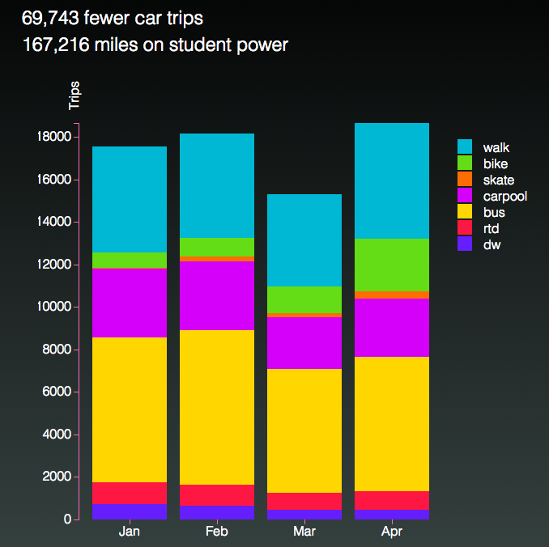
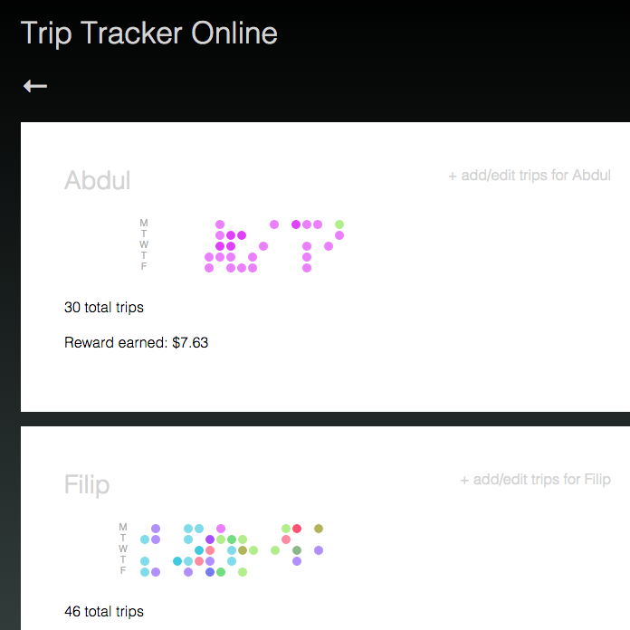
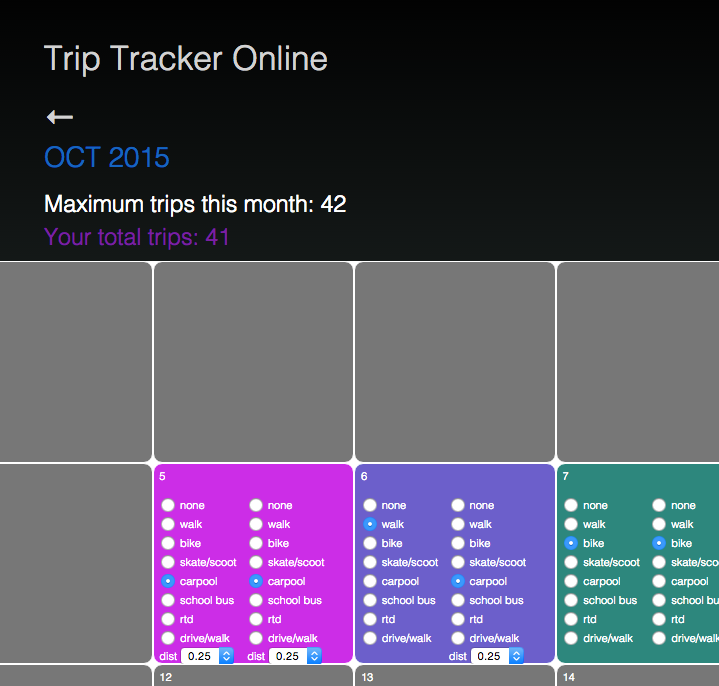

#Trip Tracker Online

A prototype web application for [Boulder Valley School District's Trip Tracker program] (http://www.bvsd.org/transportation/toschool/tracker/Pages/default.aspx) designed to reward kids taking alternative transportation to school.

[Trip Tracker Online] (http://development.triptracker.divshot.io/#/) aims to provide a fun and engaging way for students to record their trips and chart their progress online. It uses strategic color coding and data-driven graphics. See a live demo here: [http://development.triptracker.divshot.io/#/](http://development.triptracker.divshot.io/#/)(Please be patient when loading…due to free hosting it must first "wake up").

The back end is in a separate repo found here: [https://github.com/jennyknuth/triptracker](https://github.com/jennyknuth/triptracker). Using an Express/Node.js server, data from mongoDB is sent to an API hosted on Heroku.  

On the front end, a thick AngularJS client consumes the API and allows users to view, create, edit, and delete their trips. Data input is quick, responsive, and free from "submit" buttons. Color-coded trips create fun visual patterns. 

Charts are D3.js custom directives in AngularJS. 

